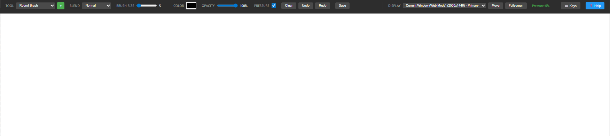
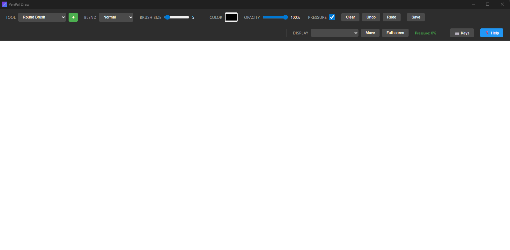
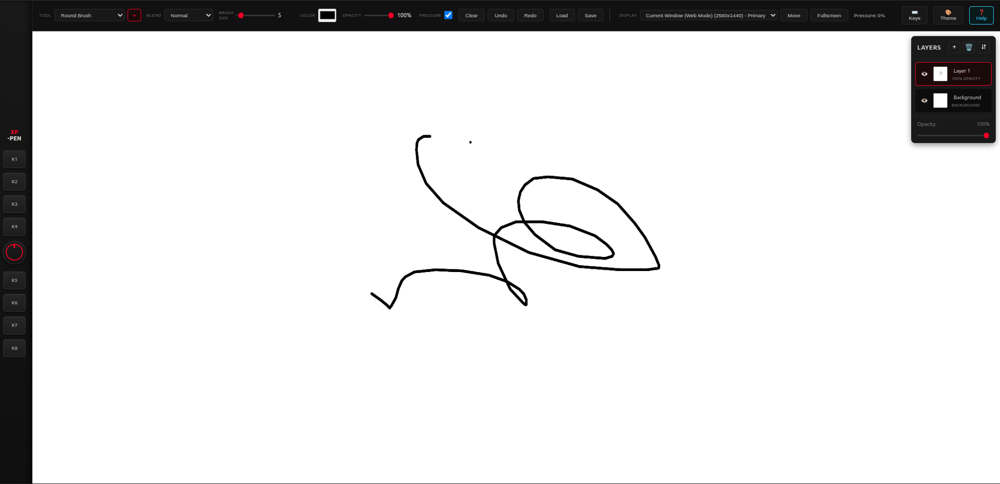

# PenPal Draw

[](https://github.com/cms000123456/penpal/actions/workflows/release.yml)
[](https://github.com/cms000123456/penpal/actions/workflows/test-build.yml)

A lightweight, cross-platform drawing app designed for the **XPPen Artist 15.6 Pro V2 Pen Display** and other pen tablets.

## Features

- 🎨 **Pressure Sensitivity** - Full support for pen pressure (requires compatible pen tablet)
- 🖥️ **Multi-Monitor Support** - Easily move the app to your pen display
- ⬜ **Fullscreen Mode** - Draw without distractions
- 🖌️ **Brush System** - Multiple brush types: Round, Square, Soft, Pencil, Marker, Spray, Charcoal
- ✨ **Custom Brushes** - Create your own brushes with adjustable hardness, spacing, texture
- ↩️ **Undo/Redo** - Ctrl+Z / Ctrl+Y to undo/redo strokes
- 💾 **Save as PNG** - Export your artwork
- ⌨️ **Shortcut Keys** - Full support for XPPen's 8 shortcut keys with customizable actions
- 🧹 **Eraser Mode** - Toggle with 'E' key or shortcut key
- 🎨 **Color Picker** - Pick colors from canvas
- ⌨️ **Keyboard Shortcuts** - Quick access to common actions
- ❓ **In-App Help** - Comprehensive documentation with search (F1)

## Screenshots

| Web Version | Windows Desktop | XP-Pen Tablet Theme |
|:--:|:--:|:--:|
|  |  |  |
| Browser-based drawing | Native Windows app with full features | Tablet mockup UI with hardware keys & dial |

*Left: Web version for quick testing. Middle: Native Windows desktop app with multi-monitor support and advanced tools. Right: XP-Pen tablet theme with mockup bezel, shortcut keys, and red accent dial.*

## Requirements

- Windows 10/11, macOS, or Linux
- XPPen Artist 15.6 Pro V2 (or any pen tablet with pressure support)
- XPPen drivers installed

## Installation

### Download Pre-built Binary

Check the [Releases](../../releases) page for pre-built binaries.

**Latest Release:** [v0.2.0](../../releases/latest)

| Platform | Download |
|----------|----------|
| Windows | `.msi` installer or `.exe` portable |
| macOS (Intel) | `.dmg` for x64 Macs |
| macOS (Apple Silicon) | `.dmg` for M1/M2/M3 Macs |
| Linux | `.deb` package or `.AppImage` portable |

### Auto-Updates
GitHub Actions automatically builds releases for all platforms when a new tag is pushed!

### Build from Source

#### Prerequisites

1. **Install Rust**: https://rustup.rs/
2. **Install Node.js**: https://nodejs.org/ (v18 or higher)

#### Build Steps

```bash
# Clone or navigate to the project
cd penpal-draw

# Install dependencies
npm install

# Generate icons (optional, already included)
python generate_icons.py

# Build for production
npm run build

# Or run in development mode
npm run dev
```

The built app will be in `src-tauri/target/release/bundle/`.

## Usage

### First Time Setup

1. **Connect your XPPen Artist 15.6 Pro V2**
2. **Install XPPen drivers** from https://www.xp-pen.com/download
3. **Launch PenPal Draw**
4. **Select your pen display** from the "Display" dropdown
5. **Click "Move"** to move the window to your pen display
6. **Click "Fullscreen"** for the best drawing experience

**Need Help?** Press **F1** or click the **❓ Help** button for comprehensive documentation!

### Drawing

- **Draw**: Use your pen on the canvas
- **Pressure**: Press harder for thicker lines (toggle with checkbox)
- **Brush Size**: Adjust with the slider (1-100)
- **Color**: Pick from the color selector
- **Opacity**: Adjust transparency (1-100%)

### Tools

**Brushes:**
- **Round** - Standard circular brush
- **Square** - Hard-edged square brush
- **Soft** - Soft-edged circular brush
- **Pencil** - Textured pencil effect
- **Marker** - Broad marker with variable opacity
- **Spray** - Airbrush spray effect
- **Charcoal** - Grainy texture brush

**Tools:**
- **Eraser** - Three modes: Pixel (hard), Brush (soft), Block (square)
- **Smudge/Blend** - Blend and smudge existing paint
- **Blur** - Blur areas of your image
- **Dodge** - Lighten areas (like photography dodge)
- **Burn** - Darken areas (like photography burn)

### Blend Modes

Available for brushes:
- **Normal** - Standard painting
- **Multiply** - Darken (shadows)
- **Screen** - Lighten (highlights)
- **Overlay** - Contrast enhancement
- **Soft Light** - Subtle lighting
- **Hard Light** - Strong lighting
- **Color Dodge** - Brighten
- **Color Burn** - Darken
- **Difference** - Invert effect
- **Exclusion** - Similar to difference, softer

### Custom Brushes

Click the **+** button next to the tool selector to create custom brushes:

1. **Brush Type** - Choose base shape (round, square, soft, textured, pattern)
2. **Hardness** - Edge softness (0-100%)
3. **Spacing** - Distance between brush stamps (1-100%)
4. **Angle** - Brush rotation (0-360°)
5. **Roundness** - Circle compression (1-100%)
6. **Min Size** - Size at minimum pressure (1-100%)
7. **Texture** - Add noise, grain, dots, or lines (for textured brushes)

Custom brushes are saved automatically and persist between sessions!

### Keyboard Shortcuts

| Shortcut | Action |
|----------|--------|
| `Ctrl + Z` | Undo last stroke |
| `Ctrl + Y` or `Ctrl + Shift + Z` | Redo last stroke |
| `Ctrl + S` | Save image |
| `E` | Toggle eraser mode |
| `[` / `]` | Decrease / Increase brush size |

### Shortcut Keys (XPPen Tablet)

Click the **⌨️ Keys** button in the toolbar to configure your XPPen Artist 15.6 Pro V2's 8 shortcut keys.

**Available Actions:**
- Brush types (Round/Soft/Pencil/Marker/Spray)
- Brush sizes (Small/Medium/Large)
- Colors (Black/White/Red/Pick from canvas)
- Undo / Redo
- Clear canvas
- Save
- Toggle eraser
- Toggle fullscreen

**Setup:**
1. Click **⌨️ Keys** in the toolbar
2. Click **"Auto-Detect XPPen Keys"**
3. Press each shortcut key (K1-K8) on your tablet in order
4. Or manually select an action for each key and click "Click to bind", then press the desired key

**Recommended XPPen Configuration:**
In your XPPen tablet software, set the shortcut keys to send:
| Key | Binding | Suggested Action |
|-----|---------|------------------|
| K1 | `Ctrl+F1` | Brush: Medium |
| K2 | `Ctrl+F2` | Brush: Large |
| K3 | `Ctrl+F3` | Color: Black |
| K4 | `Ctrl+F4` | Color: White |
| K5 | `Ctrl+F5` | Undo |
| K6 | `Ctrl+F6` | Toggle Eraser |
| K7 | `Ctrl+F7` | Clear Canvas |
| K8 | `Ctrl+F8` | Save |

### Pressure Indicator

The pressure indicator in the toolbar shows your current pen pressure:
- **Gray** - No pressure
- **Yellow** - Light pressure (< 30%)
- **Green** - Medium pressure (30-70%)
- **Red** - Heavy pressure (> 70%)

## Troubleshooting

### Pressure Sensitivity Not Working

1. Make sure XPPen drivers are installed and running
2. Check that "Pressure" checkbox is enabled in the toolbar
3. Restart the app after installing drivers
4. In XPPen drivers, ensure "Windows Ink" is enabled

### App Doesn't Move to Pen Display

1. Make sure your XPPen is connected and recognized by Windows
2. Try manually dragging the window to the pen display
3. Use the "Fullscreen" button once on the correct display

### Lag or Stuttering

1. Reduce brush size
2. Close other applications
3. Check CPU/GPU usage

## Development

### Project Structure

```
penpal-draw/
├── src/                    # Frontend (HTML/CSS/JS)
│   ├── index.html         # Main UI
│   ├── main.js            # Drawing logic
│   └── styles.css         # Styling
├── src-tauri/             # Backend (Rust)
│   ├── src/main.rs        # Rust code
│   ├── icons/             # App icons
│   └── Cargo.toml         # Rust dependencies
└── package.json           # Node dependencies
```

### Technologies

- **Tauri** - Rust-based framework for desktop apps
- **HTML5 Canvas** - Drawing surface
- **Pointer Events API** - Pen/mouse/touch input
- **Vanilla JavaScript** - No framework overhead

## License

MIT License - Feel free to use and modify!

## Support

If you encounter issues or have feature requests, please open an issue on GitHub.

---

**Enjoy drawing with your XPPen Artist 15.6 Pro V2!** 🎨
